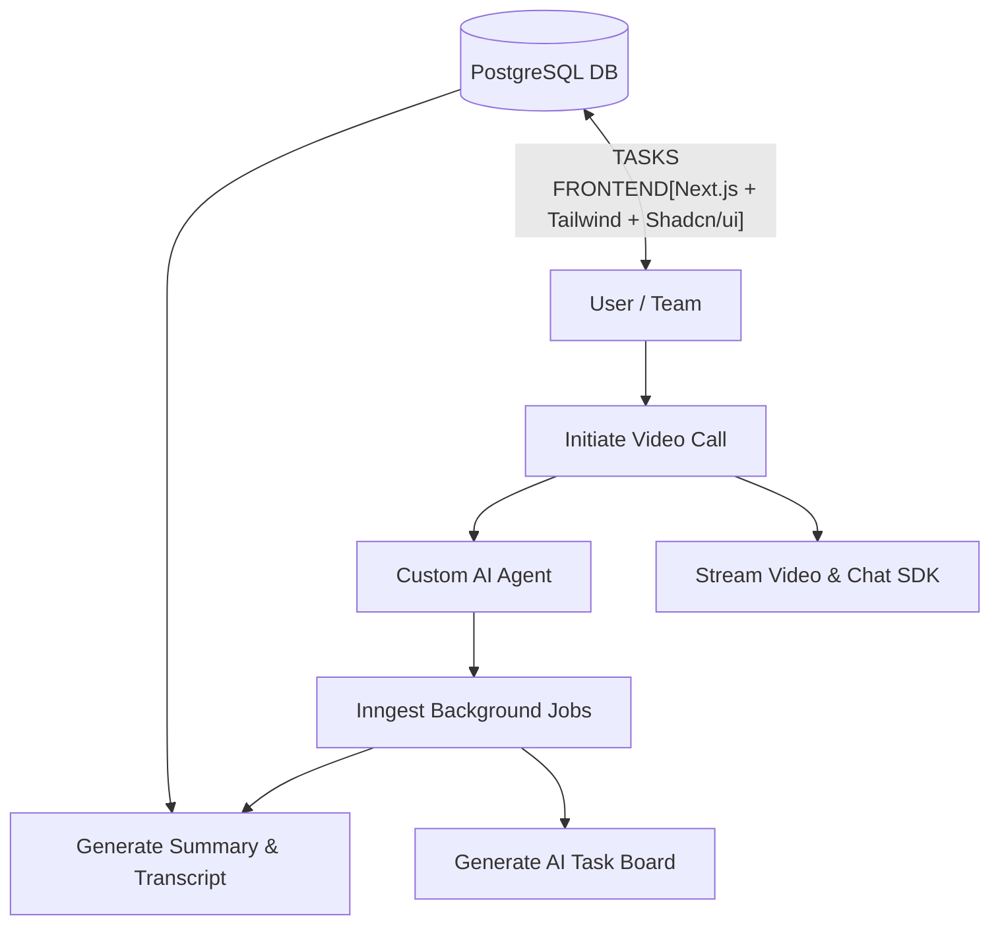

<div align="center">

# **CollabSphereAI: AI-Powered Video Call Platform**

[](https://nextjs.org/)  
[](https://reactjs.org/)  
[](https://tailwindcss.com/)  
[](https://getstream.io/video/)  
[](#)  
[](#)


**Collaborate smarter — AI-enhanced video calls from start to finish.**

[🚀 Live Demo](#) • [🔧 Installation](#installation)

</div>

---

## ✨ Overview

**CollabSphereAI** is a **Next.js-powered** AI video call platform that lets teams collaborate with **real-time AI agents**, generate **summaries, transcripts, and task boards**, and analyze conversations for expertise, emotions, and role attribution.  

The platform enables:  
- **AI-powered video calls** with custom agents.  
- **Summaries & transcripts** using background jobs.  
- **Meeting history & statuses** with detailed analytics.  
- **Post-call task and role management** generated automatically by AI.  
- **Authentication & subscriptions** with Better Auth.  
- **Mobile-responsive, fully interactive UI** built with Tailwind v4 + Shadcn/ui.  

---

## 🎯 Key Features

### 🤖 AI Video Calls
- Real-time video meetings powered by **Stream Video SDK**.  
- Customizable AI agents for each meeting.  
- Role-based insights, emotional analysis, and expertise detection.


### 🧠 AI Agents & Analysis
- Background processing with **Inngest jobs**.  
- Summaries, transcripts, and AI Q&A for each meeting.  
- Automatic task & role assignment per user based on conversation.  


### 📂 Meeting History & Insights
- Store past meetings with transcripts, summaries, and AI-generated boards.  
- Search and filter transcripts by keywords, roles, or user.  
- Insights on user contributions, tasks, and AI recommendations.  


### 🔐 Authentication & Integrations
- Login via **Better Auth**, GitHub, and Google.  
- Groq integration for AI insights.  
- Stream Chat SDK for interactive messaging during calls.  


---

## 🏗️ Architecture


---

## 🚀 Technology Stack
- **Frontend:** Next.js 15 + React 19, Tailwind v4, Shadcn/ui
- **Backend / Jobs:** Inngest background jobs, Node.js
- **Video & Chat:** Stream Video SDK, Stream Chat SDK
- **Authentication:** Better Auth, GitHub, Google
- **Database:** PostgreSQL (Neon)
- **AI & NLP:** Groq, custom AI agents
- **Deployment:** Vercel / Cloud (TBD)

---

## ⚡ Quick Start
```bash
# 1. Clone the repository
git clone https://github.com/Esra2brahmi/collabsphereai.git
cd collabsphereai

# 2. Install dependencies
npm install --legacy-peer-deps
# or
yarn install

# 3. Add your `.env` file with API keys and database credentials

# 4. Start the development server
npm run dev
# or
yarn dev


# 5. Open the app
 Visit http://localhost:3000
```


---
## 🛣️ Future Features
- 🔮 Predictive AI insights – automatic detection of key discussion points and follow-ups
- 🌐 Global meeting analytics – visualize team performance and AI recommendations
- 📱 Mobile app integration – seamless AI-assisted collaboration on iOS/Android
- ☁️ Cloud-native scaling – distributed video processing for enterprise teams

## 🏗️ Built In
Made with ❤️ using **Next.js, React, Tailwind, Stream SDKs, and AI tools**

